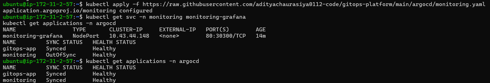
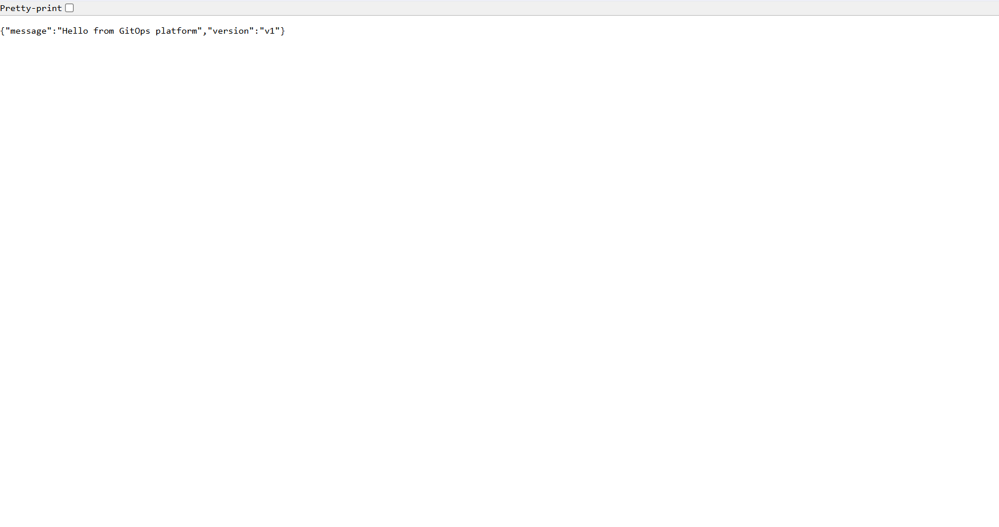
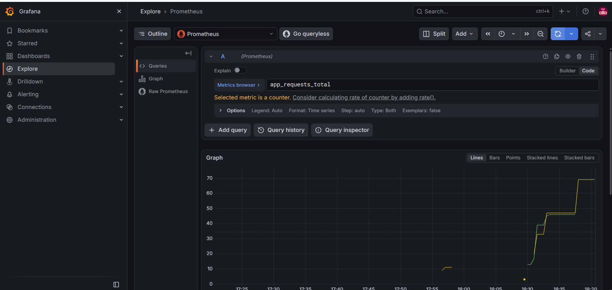
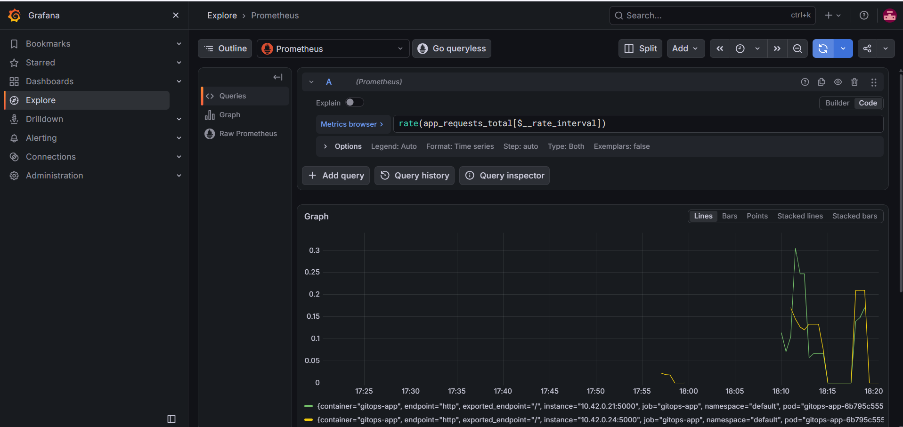
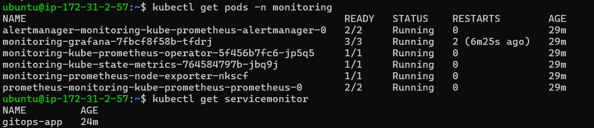

# GitOps Platform on AWS (k3s)

A small end-to-end GitOps setup: a push to GitHub builds a container image, and ArgoCD deploys it to a Kubernetes cluster by itself.

Flow: git push -> GitHub Actions builds image -> image pushed to ghcr.io -> ArgoCD syncs k8s/ manifests -> app runs on k3s (AWS EC2)

## Tech stack
- App: Python Flask (with /health and Prometheus /metrics), Docker (non-root user)
- CI: GitHub Actions (Hadolint, import test, build and push to GitHub Container Registry)
- Cluster: k3s on an AWS EC2 Ubuntu server
- CD: ArgoCD (automated sync, prune and self-heal)
- Monitoring: Prometheus and Grafana (kube-prometheus-stack, installed through ArgoCD)

## Why k3s and not EKS
EKS charges for the control plane even when idle. To keep cloud cost near zero, this project runs k3s on a single EC2 instance that is stopped when not in use. The same manifests and ArgoCD setup work on EKS.

## Results
- Git push to live deployment: ~2-3 minutes (ArgoCD auto-sync)
- Rollback with git revert: ~2 minutes
- Self-heal: a deleted Deployment was recreated automatically within seconds
- Stop and start of the server: k3s, ArgoCD and the app came back on their own

## Screenshots

### 1. ArgoCD applications

Terminal output from the k3s server. Both ArgoCD applications, `gitops-app` and `monitoring`, are Synced and Healthy, which means the cluster matches what is in Git. The `monitoring` app briefly showed OutOfSync right after I changed its config in Git, and then synced on its own.

### 2. App running on the cluster

The Flask app deployed by ArgoCD answers on the server through a NodePort service and returns its version (v1).

### 3. Request counter in Grafana

`app_requests_total` from the app's /metrics endpoint, scraped by Prometheus and shown per pod. There are two lines because the Deployment runs two replicas.

### 4. Request rate in Grafana

`rate(app_requests_total[...])` shows requests per second for each pod, so traffic spikes are easy to see.

### 5. Monitoring stack

All monitoring pods are Running (Prometheus, Alertmanager, Grafana, operator, kube-state-metrics, node-exporter), and the `gitops-app` ServiceMonitor exists so Prometheus knows what to scrape. Grafana restarted twice during its first start because the 4 GB server was under memory pressure.

## Monitoring
A ServiceMonitor makes Prometheus scrape the app's /metrics endpoint, and Grafana shows the request counter and request rate per pod.

## Design decisions
- k3s on a single EC2 instance instead of EKS, to avoid the EKS control-plane cost while keeping the same Kubernetes manifests and ArgoCD workflow.
- GitOps: CI only builds and pushes the image. Deployments happen only through Git, with ArgoCD automated sync, prune and self-heal.
- Image tags use the commit SHA instead of latest, so every deployment can be traced and rolled back with git revert.
- Secrets are not stored in Git. The Grafana admin password lives in a Kubernetes Secret created on the cluster.
- The server is disposable: everything needed to recreate it is in this repository (setup/setup.sh and the ArgoCD applications).
- Resource requests and limits are set on the app and on the monitoring stack, and Prometheus keeps only 3 days of data, to fit a 4 GB node.

## Known limitations
- Single node, so there is no high availability.
- The image tag in k8s/deployment.yaml is updated by hand. Next step is to let the CI pipeline update it automatically.
- Grafana is exposed over plain HTTP on a NodePort, limited to my IP by the security group. It is for demo use and should sit behind an ingress with TLS in a real setup.
- Alerting (Alertmanager to Slack) is not configured yet.

## Rebuild the platform
On a fresh Ubuntu server, download and run the setup script:

    curl -fsSLO https://raw.githubusercontent.com/adityachaurasiya0112-code/gitops-platform/main/setup/setup.sh
    bash setup.sh

## Status
- [x] Sample app and Dockerfile
- [x] CI pipeline (build and push image)
- [x] Kubernetes manifests
- [x] k3s on EC2 and ArgoCD
- [x] Self-heal, version change via Git, rollback test
- [x] setup.sh to rebuild the server quickly
- [x] Prometheus and Grafana monitoring
- [ ] Slack alerts via Alertmanager
- [ ] CI updates the image tag in k8s/ automatically
- [ ] Architecture diagram
